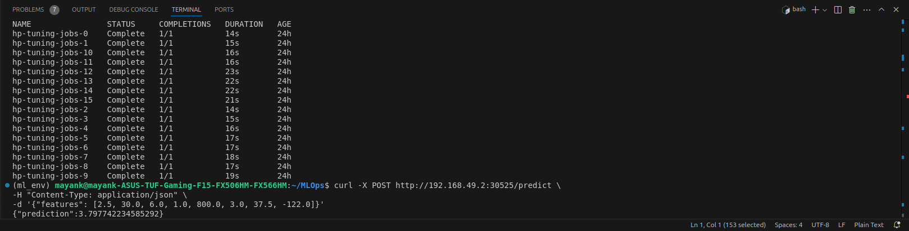

# House Price Prediction using Random Forest

This project demonstrates an end-to-end process of training a regression model to predict house prices, performing hyperparameter tuning using parallelization in Kubernetes, and deploying an inference API using Docker and Kubernetes, CI/CD Pipeline using Git Actions and GCP services.

## Overview
The objective of this project is to build a regression model that predicts house prices using the **California Housing dataset**. The project involves hyperparameter tuning using Kubernetes for parallelization and deploying the trained model as an inference service using Flask, Docker, and Kubernetes.

## Prerequisites
- **Python 3.9** or higher installed.
- **Minikube** installed and running.
- **Docker Engine** installed and configured.
- **kubectl** installed and configured.

## Dataset
This project uses the **California Housing dataset** provided by scikit-learn. The dataset contains 8 features describing demographic and geographic data related to house prices.

# Task 1
## Instructions on how to reproduce the pipelines for Task 1
Detailed instructions of how you re-implemented parallel hyperparameter tuning:
- Uncomment `train_and_evaluate_model(X_train, y_train, X_val, y_val, args)` in `__main__` block and comment out the following:
```
try:
        best_hyperparams = load_best_hyperparameters('best_hyperparams.json')
    except FileNotFoundError as e:
        print(e)
        exit(1)
    
    train_final_model(features_scaled, target_value, best_hyperparams)
```
- In `Dockerfile` uncomment the commented block and comment the uncommented block. It should look like the following:
```
# Uncomment this to run house_price_prediction.py for hyperparameter tuning
FROM python:3.9-slim
WORKDIR /app
COPY requirements.txt requirements.txt
RUN pip install -r requirements.txt

COPY . .
CMD ["python", "house_price_prediction.py"]


# FROM python:3.9-slim
# WORKDIR /app
# COPY requirements.txt requirements.txt
# RUN pip install -r requirements.txt
# RUN pip install flask
# COPY . .
# CMD ["python", "inference_api.py"]

```
- To Run hyperparameter tuning in parallel run the following commands in your terminal:
```
minikube start --cpus=4 --memory=8192mb
eval $(minikube -p minikube docker-env)
# Create docker image inside minikube node
docker build -t house-price-model:v1 .

# Generate Kubernetes job YAMLs
# I suggest deleting generated_jobs after cloning repos and running this command
# to create new jobs in your local system. It will create generated_jobs folder automatically
python generate_k8s_jobs.py

# Apply all the jobs created by generate_k8s_jobs.py
kubectl apply -f generated_jobs/

# List all jobs
kubectl get jobs

# List all pods (to monitor status)
kubectl get pods

# Wait until all pods have a STATUS of Completed.
mkdir -p results

# Retrieve logs from each completed pod and save them locally
for pod in $(kubectl get pods --no-headers -o custom-columns=":metadata.name" | grep hp-tuning-jobs); do
    kubectl logs $pod | tee ./results/$pod-results.txt
done

# Run the script to find the best model
python find_best_model.py
```
- The above commands will find and save the best hyperparameter as best_hyperparams.json. I trained the model on these hyperparameters. I order for you to redo it follow the following steps:
    - Comment `train_and_evaluate_model(X_train, y_train, X_val, y_val, args)` in `__main__` block and uncomment out the following:
```
try:
        best_hyperparams = load_best_hyperparameters('best_hyperparams.json')
    except FileNotFoundError as e:
        print(e)
        exit(1)
    
    train_final_model(features_scaled, target_value, best_hyperparams)
```
- run `python house_price_prediction.py`. This will re-train the dataset on best hyperparameters and save the model as a .pkl file

## Next step is to deploy the model for inference, I again used kubernetes for this task:
- First step was to update `Dockerfile` to run `inference_api.py`. You can comment the current block in docker and uncomment the current block. Your Dockerfile should look as follow:
```
# Uncomment this to run house_price_prediction.py for hyperparameter tuning
# FROM python:3.9-slim
# WORKDIR /app
# COPY requirements.txt requirements.txt
# RUN pip install -r requirements.txt

# COPY . .
# CMD ["python", "house_price_prediction.py"]


FROM python:3.9-slim
WORKDIR /app
COPY requirements.txt requirements.txt
RUN pip install -r requirements.txt
RUN pip install flask
COPY . .
CMD ["python", "inference_api.py"]
```
- Run the following commands in your terminal:
```
eval $(minikube -p minikube docker-env)
# Create docker image inside minikube node
# If you want to change house-price-model:v6 to house-price-model:vx (x being any number) make sure to change the image name in inference_deployemt.yaml
docker build -t house-price-model:v6 .

# Apply the job
kubectl apply -f inference_deployment.yaml

# Find the NodePort and Minikube IP
# Use these to form the API URL: http://<minikube_ip>:<node_port>/predict
kubectl get svc rf-inference
minikube ip

# Use curl or any HTTP client to test the API
curl -X POST http://192.168.49.2:30525/predict \
-H "Content-Type: application/json" \
-d '{"features": [2.5, 30.0, 6.0, 1.0, 800.0, 3.0, 37.5, -122.0]}'
```
- This will predict the output from your deploed inference model. I have saved the result given by the above command in inference.txt

I followed the above step to complete the task one, You can re-create it by following the above step as it is.

## Evaluation:
- Used R-squared (R²) on a validation set.
- Store each trial of hyperparameter tuning along with their evaluation metrics. Refer .results/ directory

## Challenges in Task 1:
- I tried auto-scaling by using and configuring minikubes with the help of hpa.yaml
- I was facing TLS error while connecting to metrics server.
- This error occurs because the metrics server is trying to access node metrics via a secured HTTPS connection, but it cannot verify the node's certificate.
- I tried to resolve this issue by allowing insecure TLS verification for the metrics server
- It didn't worked and was getting Metrics API not available
- A work around could be directly scaling the deployment using replicas.

Below is the screen shot of my result of implementation of hyperparameter and output of deployed model for inference


# Task 2
complete CI/CD pipeline to automate model testing, building, and deployment using GitHub Actions, GCR, and Google Cloud Run. The pipeline ensures continuous integration and delivery, enabling seamless model updates to production when code changes are pushed.

## Prerequisites
- Google Cloud Account with a project set up.
- GitHub Account with access to the repository.
- Installed Tools:
    - Google Cloud SDK
    - Docker
    - Python 3.9+

I followed the following steps. You can reproduce the pipeline doing the same step:
- Install Google Cloud CLI:
    - Download and install it
    - Once installed, authenticate using `gcloud auth login`
    - Setup you default project using `gcloud config set project YOUR_PROJECT_ID`
- Build the docker image using inference_api.py using `docker build -t house-price-model .`
- Enable the Container Registry API:
    - In the Google Cloud Console, go to APIs & Services > Enable APIs & Services, and search for Container Registry API to enable it.
- Authenticate Docker to GCR using `gcloud auth configure-docker`
- Tag the Docker image using `docker tag house-price-model gcr.io/YOUR_PROJECT_ID/house-price-model:latest`
- Push the Docker image to GCR using `docker push gcr.io/YOUR_PROJECT_ID/house-price-model:latest`
- Go to APIs & Services in the Google Cloud Console and enable the Cloud Run API.
- Run the following command to deploy your containerized application:
    ```
    gcloud run deploy house-price-api \
  --image gcr.io/YOUR_PROJECT_ID/house-price-model:latest \
  --platform managed \
  --region us-central1 \
  --allow-unauthenticated
    ```
- After successful deployment, you’ll get a URL where the API is hosted (e.g., https://house-price-api-xxxxxx.a.run.app). For me it was  https://house-price-api-11295200031.us-central1.run.app
- You can send a POST request to this URL at /predict with the input JSON format

## GitHub Actions CI/CD Pipeline
- I created CI/CD pipeline using .yml file. The CI/CD pipeline is defined in the .github/workflows/ci_cd_pipeline.yml file. It automates testing, building, and deployment of the model. Refer ci_cd_pipeline.yml for more detail, I have documented it in detail. Automated Testing is done using test_model.py script in ./tests directory
- It triggers a build when new code is pushed to a Git repository.
- Deploys the model to production when tests pass
- Make sure to setup github secrets:
    - GCP_PROJECT_ID: Your Google Cloud Project ID.
    - GCP_SERVICE_ACCOUNT_KEY: The base64-encoded service account key (created in the Google Cloud Console).

After that I pushed my file to git repos which trigerred the CI/CD Pipeline. I have also included an additional step in ci_cd_pipeline.yml where model predictes on your custom feature that you sent via POST Request. Refer deploy_cloud_run logs in github action

- You can Test the Deployed Model:
```
curl -X POST \
  -H "Content-Type: application/json" \
  -d '{"features": [3.87, 19.0, 6.5, 1.01, 880, 3.3, 34.26, -118.41]}' \
  https://YOUR_SERVICE_URL/predict
```

For me it is:
```
curl -X POST \
            -H "Content-Type: application/json" \
            -d '{"features": [3.87, 19.0, 6.5, 1.01, 880, 3.3, 34.26, -118.41]}' \
            https://house-price-api-11295200031.us-central1.run.app/predict
```

You can directly run it on your terminal to test that my deployed model is working.

## Challenges:
- I tried to use kubernetes (minikube) to deploy and setup CI/CD pipeline using Kubernetes but was unsuccessful, because of many reasons. They are explicitly log on github actions.
- So I switch to different approach to use GCR
